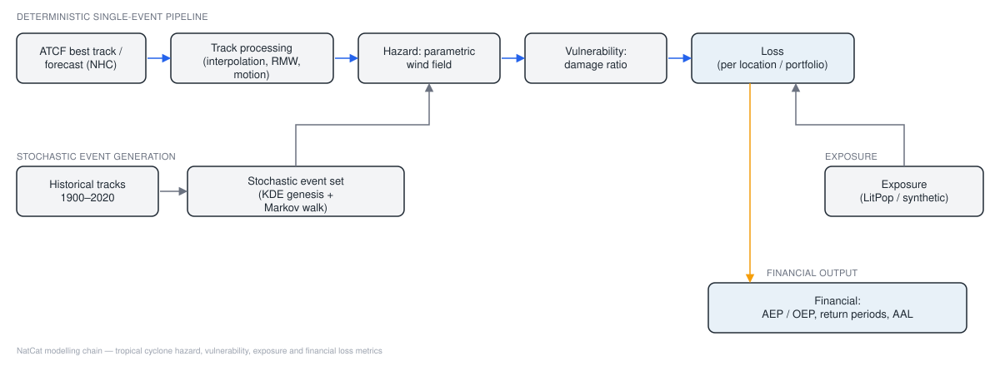
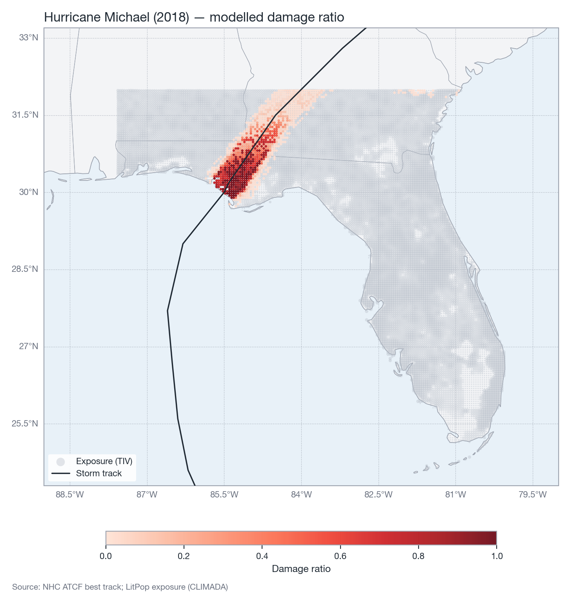
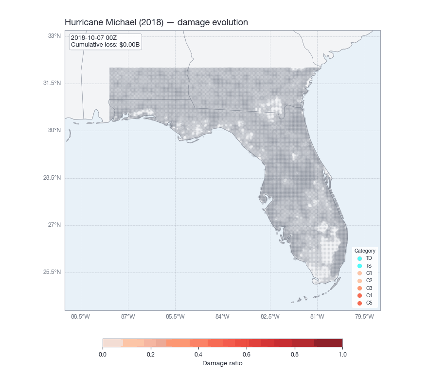

<p align="center">
  
</p>

<h1 align="center">NatCat</h1>

<p align="center">
  <em>An open tropical-cyclone catastrophe-modelling framework: from storm track to loss, and from
  a century of historical tracks to a stochastic event set with exceedance-probability curves.</em>
</p>

<p align="center">
  <a href="https://github.com/christianwirths/NatCat/actions/workflows/ci.yml"></a>
  <a href="https://christianwirths.github.io/NatCat/"></a>
  
  <a href="LICENSE"></a>
</p>

---

NatCat implements the standard catastrophe-model chain used in (re)insurance for the tropical
cyclone (TC) peril:

| Component | What it does | Module |
|---|---|---|
| **Data** | Reads NHC ATCF best-track (B-deck) and forecast (A-deck) files, downloads the archive on demand | `natcat.data` |
| **Tracks** | De-duplicates fixes, fills missing radius of maximum wind, interpolates to a fine time step, derives translation speed and heading | `natcat.tracks` |
| **Hazard** | Vectorised parametric wind field (Rankine vortex with motion asymmetry) giving maximum sustained wind at every location | `natcat.hazards` |
| **Vulnerability** | Sigmoid damage functions by construction type | `natcat.vulnerability` |
| **Exposure** | Synthetic portfolios or real asset values via CLIMADA's LitPop | `natcat.exposure` |
| **Loss** | Per-location and portfolio ground-up loss, time-evolving loss, multi-year simulation | `natcat.loss` |
| **Stochastic** | Empirical Markov track generator calibrated on 1900–2020 Atlantic best tracks | `natcat.stochastic` |
| **Financial** | AEP/OEP curves with a generalized-Pareto tail, return periods, average annual loss | `natcat.financial` |
| **Plotting** | Publication-quality maps, curves and animations in a consistent house style | `natcat.plotting` |

Full documentation, methodology and API reference: **https://christianwirths.github.io/NatCat/**

## Installation

```bash
git clone https://github.com/christianwirths/NatCat.git
cd NatCat
conda env create -f environment.yml   # creates the "NatCat" env and installs natcat in editable mode
conda activate NatCat
```

Or into an existing environment:

```bash
pip install -e .            # core: numpy, pandas, scipy, matplotlib, scikit-learn, ...
pip install -e ".[geo]"     # + cartopy (maps) and climada (LitPop exposure)
pip install -e ".[dev,docs]"
```

Track data is downloaded from the NHC archive on first use into `data/raw/` (override with the
`NATCAT_DATA_DIR` environment variable).

## Quickstart: Hurricane Michael (2018)

```python
from natcat import (
    LossCalculator, TropicalCycloneHazard, WindVulnerability,
    load_best_track, synthetic_portfolio, plotting,
)

track = load_best_track(2018, "al", "14")                      # NHC id AL142018, 5-minute track
portfolio = synthetic_portfolio(n=2000, bounds=(29.0, 31.0, -86.5, -84.5), seed=1)

calc = LossCalculator(TropicalCycloneHazard(track), WindVulnerability())
result = calc.compute(portfolio)                               # adds intensity, damage_ratio, loss
print(f"Ground-up loss: ${calc.total_loss/1e6:,.1f} M")

plotting.plot_footprint(result, extent=(-89, -79, 24.3, 33.2), portfolio=portfolio, track=track)
```

<p align="center">
  
</p>

The same pipeline evaluated at successive time steps gives the damage evolution as the storm
crosses the portfolio:

<p align="center">
  
</p>

## Stochastic event set and risk metrics

```python
from natcat import SyntheticTCCatalog, LossSimulator, ExceedanceProbability, load_litpop_exposure

catalog = SyntheticTCCatalog(seed=42).fit("data/raw")          # 1,495 historical Atlantic tracks
portfolio = load_litpop_exposure("USA", bounds=(24.5, 32.0, -87.6, -80.0))

results = LossSimulator(catalog, portfolio, WindVulnerability(), seed=42).run(n_years=1000)
ep = ExceedanceProbability.from_simulation(results)

print(f"AAL: ${results.aal/1e9:.2f} B")
print("1-in-100 AEP:", ep.loss_at_return_period(100, kind="aep"))
plotting.plot_ep_curve(ep)
```

<table align="center">
  <tr>
    <td></td>
  </tr>
  <tr>
    <td align="center"></td>
  </tr>
</table>

Reference run on the Florida / Gulf-coast LitPop portfolio above (12,201 locations, total insured value $5.1 T; 1,000 simulated years, seed 42):

| Metric | Value |
|---|---|
| Average annual loss (AAL) | $8.7 B |
| 1-in-10 AEP loss | $6.1 B |
| 1-in-50 AEP loss | $77 B |
| 1-in-100 AEP loss | $147 B |
| 1-in-250 AEP loss | $312 B |

These are ground-up losses from an uncalibrated research model. See the documentation's
[limitations page](docs/methodology/limitations.md) before reading anything into the numbers.

## Example notebooks

| Notebook | Content |
|---|---|
| [`01_single_event_loss`](notebooks/01_single_event_loss.ipynb) | Best track to portfolio loss, footprint map, time-evolving damage |
| [`02_stochastic_event_set`](notebooks/02_stochastic_event_set.ipynb) | Genesis sampling, Markov track walk, historical vs synthetic comparison |
| [`03_portfolio_risk_metrics`](notebooks/03_portfolio_risk_metrics.ipynb) | Multi-year simulation, AAL, AEP/OEP, return periods, layer pricing |

## Repository layout

```
natcat/        the package (see table above)
tests/         pytest suite, runs offline (data-dependent tests skip on a clean clone)
docs/          MkDocs Material site: user guide, methodology, API reference
notebooks/     executed example notebooks
scripts/       make_figures.py regenerates every figure in docs/assets
legacy/        first-generation A-deck forecast notebooks and modules (unmaintained)
```

## Development

```bash
pytest -q                 # tests
ruff check natcat tests   # lint
mkdocs serve              # docs at http://127.0.0.1:8000
python scripts/make_figures.py --quick   # regenerate figures (200-year simulation)
```

## Roadmap

- Intensity-conditioned radius of maximum wind in the stochastic model (currently an unconstrained
  random walk, which makes the loss tail too heavy)
- Holland (1980) wind profile and Willoughby-type RMW relations
- Vulnerability calibration against reported losses; secondary uncertainty
- Storm-surge sub-peril; East Pacific and West Pacific basins
- Reinsurance structures (excess-of-loss layers, quota share) on the event loss table

## References

- Holland, G. J. (1980). An analytic model of the wind and pressure profiles in hurricanes. *Mon. Wea. Rev.*
- Vickery, P. J., Skerlj, P. F., & Twisdale, L. A. (2000). Simulation of hurricane risk in the U.S. using empirical track model. *J. Struct. Eng.*
- Emanuel, K., Ravela, S., Vivant, E., & Risi, C. (2006). A statistical deterministic approach to hurricane risk assessment. *Bull. Amer. Meteor. Soc.*
- Coles, S. (2001). *An Introduction to Statistical Modeling of Extreme Values.* Springer.
- Eberenz, S., Stocker, D., Röösli, T., & Bresch, D. N. (2020). Asset exposure data for global physical risk assessment (LitPop). *Earth Syst. Sci. Data.*
- NHC/JTWC Automated Tropical Cyclone Forecasting (ATCF) best-track data: https://ftp.nhc.noaa.gov/atcf/

## License

MIT. Copyright (c) 2026 Christian Wirths.
