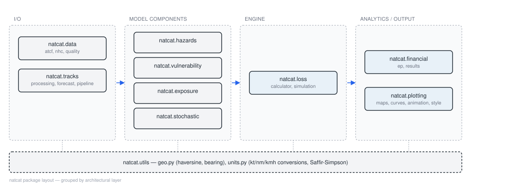

# natcat.utils

Shared geographic and unit-conversion helpers used across every other subpackage.

{ width="100%" }
*Figure: I/O, model-component, engine and analytics/output layers of the `natcat` package, with
`natcat.utils` as a shared dependency of every layer.*

## natcat.utils.geo

::: natcat.utils.geo

## natcat.utils.units

::: natcat.utils.units
