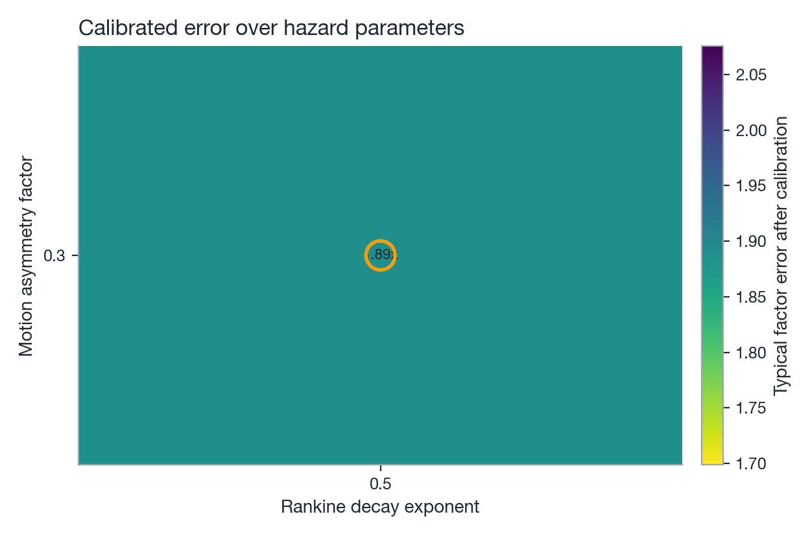

# Calibration

`natcat.calibration` fits a vulnerability model's free parameters to observed US landfall losses.
This page covers the value-dependent vulnerability model being fit, the objective it is fit to, the
optimiser, and &#8212; because a small, imperfect observed-loss table drives the result &#8212; a
frank list of caveats to read before trusting a calibrated model for anything beyond exploration.

## Value-dependent logistic vulnerability

Gridded exposure such as LitPop carries no building-level attributes (no construction class, no
building code era), but the value of a tile is a proxy for what stands on it: high-value tiles tend
to be dense, urban, engineered stock; low-value tiles tend to be rural, light-frame construction.
`ValueDependentVulnerability` keeps the [logistic damage function](vulnerability.md) of
`WindVulnerability` but lets the half-damage wind speed \(v_{50}\) vary linearly with the decadic
logarithm of tile value:

\[
v_{50}(\text{tiv}) = v_{50,\text{ref}} + v_{50,\text{slope}} \Big(\log_{10}(\text{tiv}) - \log_{10}(\text{tiv}_{\text{ref}})\Big)
\]

\[
\text{MDR}(v) =
\begin{cases}
0, & v < v_{\text{threshold}} \\[4pt]
\dfrac{s}{1 + \exp\big(-k (v - v_{50}(\text{tiv}))\big)}, & v \ge v_{\text{threshold}}
\end{cases}
\]

where \(v\) is wind speed (kt), \(\text{tiv}\) is the value of the exposure tile (USD) and
\(s\) is the share of a tile's value that wind can destroy at all: gridded exposure lumps buildings
together with land, infrastructure and contents that never reach a total loss. Five scalars are
calibratable (`model.params`):

| Parameter | Default | Meaning |
|---|---|---|
| `threshold_kt` | 40 kt | Wind speed below which no damage occurs |
| `v50_ref` | 105 kt | Half-damage wind speed of a tile worth `tiv_ref` |
| `v50_slope` | 0 kt/decade | Change in \(v_{50}\) per decade (factor of 10) of tile value; positive means higher-value tiles are sturdier |
| `k` | 0.12 /kt | Steepness of the logistic curve around \(v_{50}\) |
| `scale` | 1.0 | Upper limit \(s\) of the damage ratio (wind-damageable share of tile value) |

`tiv_ref` (default $10 M) is **not** calibrated; it only fixes the tile value about which the slope
pivots. `v50_bounds` (default 50&#8211;250 kt) clips the value-dependent \(v_{50}\) so extreme tile
values stay in a physically meaningful range. With `v50_slope = 0` and `scale = 1` the model reduces exactly to a
single `WindVulnerability` curve, so calibration can start from a construction-class-agnostic
baseline and let the data decide whether value should matter.

## Objective function

`Calibrator` minimises the weighted mean squared decadic log ratio of modelled to observed loss
across the calibration set of storms \(s\):

\[
J(\theta) = \frac{\sum_s w_s \,\big[\log_{10} L_s(\theta) - \log_{10} O_s\big]^2}{\sum_s w_s}
\]

where \(L_s(\theta)\) is the modelled ground-up portfolio loss for storm \(s\) under parameters
\(\theta\), \(O_s\) is the (GDP-normalised, by default) observed loss, and \(w_s\) is the storm's
`weight` (default 1 for every storm; set via the observed-loss table's `weight` column). A floor of
$1 keeps \(\log_{10}\) finite for a parameter set that produces zero loss for some storm.

Log ratios rather than absolute or relative errors, for two reasons:

- **Symmetry.** A factor-of-two overestimate and a factor-of-two underestimate contribute the same
  penalty; a plain squared or relative error penalises overestimation and underestimation
  asymmetrically once losses span orders of magnitude.
- **Scale-fairness.** Observed losses in the bundled table range from about $1 B (Hanna, 2020) to
  $26.5 B (Andrew, 1992). A squared-USD objective would be dominated entirely by the handful of
  largest storms; the log-ratio objective keeps a $25 B storm and a $1 B storm on equal footing, so
  the fit is not just a fit to Andrew and Michael.

`CalibrationResult.rmse_log10` is \(\sqrt{J(\theta)}\), and `10 ** rmse_log10` is reported as a
"typical factor error" &#8212; the multiplicative miss a storm at the RMS residual would show.

## Optimiser

`Calibrator.fit(method="global")` (the default) runs `scipy.optimize.differential_evolution`
&#8212; a population-based global optimiser that does not require a gradient or a good starting
point &#8212; over the model's `bounds`, followed by a bounded Nelder-Mead local polish from the
global optimum (`polish=True`). Differential evolution is used because \(J(\theta)\) is not convex
in the logistic parameters: `threshold_kt`, `v50_ref` and `k` trade off against each other (a
higher threshold and a lower \(v_{50}\) can produce similar losses for the storms in the sample),
so a purely local optimiser started from a poor guess can converge to a shallow local minimum.
`method="local"` skips the global search and runs Nelder-Mead directly from the model's current
parameters &#8212; faster, and appropriate once a global fit already gives a reasonable starting
point (e.g. re-fitting after a small change to the observed-loss table). In both cases, `fit` never
returns parameters with a worse objective than the starting model; if the optimiser fails to
improve, it keeps the starting values and logs a warning.

## Hazard parameter grid

`Calibrator` only fits the vulnerability; the Rankine decay exponent and motion-asymmetry factor
(see [Wind field](wind-field.md)) are hazard parameters, and changing either one changes the wind
footprint of every storm, not just the loss for a fixed footprint. They cannot be folded into the
inner optimisation as ordinary calibratable parameters &#8212; the objective would need to
recompute an `(track points, exposure locations)` footprint at every evaluation instead of reusing
a cached one, which is orders of magnitude slower over hundreds of evaluations.

`calibrate_hazard_grid(inputs, model, decay_exponents=(0.5, 0.75, 1.0, 1.5, 2.0), asymmetry_factors=(0.3, 0.5, 0.7))`
instead treats them as an outer loop: for every grid point it rebuilds the `TropicalCycloneHazard`
with that `decay_exponent`/`asymmetry_factor`, recomputes every storm's footprint
(`cases_from_inputs`), runs the full inner `Calibrator.fit` on the resulting cases, and records the
calibrated objective. The grid point with the lowest calibrated objective wins &#8212; not the point
that fits best *before* calibration, since the vulnerability can partially compensate for a
mis-shaped footprint and the interesting comparison is what each hazard shape allows the best
possible vulnerability fit to achieve.

{ width="100%" }
*Figure: typical factor error after calibration at every (decay exponent, asymmetry factor) grid
point; the circled cell is the winner.*

Across the grid, lower decay exponents are consistently better (1.77x&#8211;2.08x typical factor
error), and `exponent=0.5, factor=0.3` &#8212; the textbook "modified Rankine" shape, with the
smallest motion-asymmetry contribution tried &#8212; wins outright. These are now
`DEFAULT_DECAY_EXPONENT` and `DEFAULT_ASYMMETRY_FACTOR` in `natcat.hazards.wind_field`.

## Observed-loss data

The bundled table (`natcat/calibration/data/nhc_us_landfall_losses.csv`) lists US tropical cyclone
landfalls with the **total damage estimate from the NHC Tropical Cyclone Report (TCR)** of each
storm, in nominal USD of the loss year &#8212; the NHC's own post-storm damage assessment, not an
insurance industry loss estimate. `normalise_losses(method="gdp")` (the default) scales these
nominal figures to the exposure's reference year (2018 for the bundled LitPop default) by the ratio
of US nominal GDP between the loss year and the reference year: nominal GDP grows with prices,
population and real income per head, which makes it a compact stand-in for the price &times; wealth
&times; population normalisation of Pielke et al. (2008) &#8212; the standard approach in the
hurricane-normalisation literature for comparing storms from different decades on a like-for-like
exposure basis. `method="cpi"` is still available and scales by US CPI-U alone (prices only, no
exposure-growth correction); `method="none"` applies no scaling.

Every row carries a `damage_driver` (`wind`, `mixed`, `surge`, `flood`) and an `include` flag.
Storms whose TCR narrative attributes most of the damage to storm surge or rainfall/inland flooding
&#8212; Katrina and Rita (2005, surge), Ike (2008, surge), Irene (2011, inland flooding), Sandy
(2012, surge, and extratropical at landfall), Matthew (2016, flooding), Harvey (2017, rainfall
flooding), Florence (2018, rainfall flooding), and Dorian (2019, Outer Banks surge) &#8212; are
excluded by default (`include=False`), because `TropicalCycloneHazard`/`ValueDependentVulnerability`
is a wind-only model: including a surge-dominated storm's total damage as a wind-loss target would
push the fit toward wind parameters that overstate wind vulnerability to compensate for a peril the
model does not represent. The default calibration set is about 19 US landfalls between 1989 and
2020, all flagged `wind` or `mixed` (i.e. still partly non-wind, but not surge/flood-dominated).

## Calibration result

`scripts/calibrate.py` run against the bundled 19-storm set (GDP-normalised to 2018), with the
hazard grid above and `ValueDependentVulnerability`'s default bounds:

| | Before | After |
|---|---|---|
| Hazard | `exponent=2.0, factor=0.5` (pre-calibration default) | `exponent=0.5, factor=0.3` (hazard grid winner) |
| Typical factor error | 4.35x | **1.89x** |

with fitted parameters `threshold_kt=34.0`, `v50_ref=80.0`, `v50_slope=19.7` (kt per decade of tile
value), `k=0.080`, `scale=0.53`. Seventeen of the 19 storms land within a factor of two of observed.
See `docs/assets/data/calibration_result.json` for the per-storm table and
`ValueDependentVulnerability.calibrated()` for the parameters as a ready-to-use model.

Three of the five parameters sit on a bound, and that is deliberate. Storm totals alone cannot tell
a flat curve on a fully damageable tile (`k=0.054, scale=1.0`, factor error 1.77x) from a steeper
curve on a partly damageable tile (`k=0.08, scale=0.53`, 1.89x): both reproduce the 19 totals about
equally well. They differ in *where* the loss sits. The flat solution puts about 20 % damage on
low-value tiles at tropical-storm force, which spreads a hurricane's footprint over hundreds of
nautical miles at ratios no post-event survey supports. The lower bound on `k` (a 20-80 %
transition no wider than 35 kt) settles that ambiguity on the plausible side at a small cost in
fit, and `v50_bounds` keeps every tile at least as sturdy as a light-frame residential curve.
Relax `bounds=` in `Calibrator` if your own loss data can discriminate the shape.

The earlier fit on the step-table RMW with CPI normalisation and `exponent=2` was the symptom that
flagged the hazard side as broken: the pre-2005 storms in the set carry no observed RMW, and the
step table's 25 nm for Category 4+ storms made those footprints roughly 10x too intense, which the
optimiser could only partially compensate for by running to its bounds (6.7x to 2.5x).

### Independent check of the decay exponent

The hazard grid picks its exponent by loss fit. `implied_decay_exponents(data_dir)` inverts the
Rankine profile for every hurricane-strength best-track fix that reports both a radius of maximum
wind and a 34/50/64 kt wind radius (5,153 fixes from 143 storms, 2000-2020). The median implied
exponent is 0.53 (inter-quartile range 0.41-0.68; 0.48 for Category 1-2, 0.62 for Category 3+).
The loss-calibrated 0.5 therefore agrees with the wind observations, and the pre-calibration 2.0
does not.

## Caveats

Read this before using a calibrated model for anything beyond exploring how the pipeline responds
to a different vulnerability curve.

- **Total economic damage, not wind-only ground-up loss.** The NHC TCR figure is total estimated
  damage &#8212; wind, surge, inland flooding, and often indirect costs &#8212; not an insured, wind-only,
  ground-up loss. Even the storms flagged `wind`/`mixed` carry some non-wind damage; the calibration
  is implicitly asking the wind-only model to absorb that residual, which biases the fitted curve
  toward *higher* apparent wind vulnerability than a true wind-only loss would justify.
- **GDP normalisation is a national, not a coastal, proxy.** `normalise_losses(method="gdp")`
  captures national growth in prices, wealth and population, but coastal counties have grown faster
  than the nation as a whole; a storm from 1989 or 1992 is likely still under-normalised relative to
  today's coastal building stock. `method="cpi"` is available for a prices-only comparison but
  ignores exposure growth entirely, which is worse on this dimension.
- **LitPop value is not insured value.** LitPop disaggregates a proxy for asset value from
  nightlight intensity and population; it is not an actual insured-value or replacement-cost
  dataset. The calibration is fitting a wind-speed-vs-loss relationship against *this* value
  surface, so a curve calibrated here does not transfer cleanly to a portfolio valued on a different
  basis (e.g. actual insured TIV).
- **Small sample.** 19 storms drive a 5-parameter fit. This is enough to get a reasonable
  order-of-magnitude curve, not enough for the kind of statistical confidence a claims-calibrated
  industry vulnerability function would carry; a handful of storms with unusual damage narratives
  can move the fit noticeably.
- **Parameter identifiability.** `v50_slope` &#8212; the parameter that makes this model more than a
  single `WindVulnerability` curve &#8212; is only well identified if the calibration set includes
  storms that hit meaningfully different mixes of tile values (e.g. a dense urban landfall and a
  rural one). If most storms in the set hit similar value mixes, `v50_slope` trades off against
  `v50_ref` and the optimiser can settle on a slope that fits the sample without being a reliable
  estimate of how vulnerability actually varies with value.
- **Equifinality of the curve shape.** As described above, the fit is nearly flat along a ridge that
  trades curve steepness against the damageable share; the reported parameters are the plausible end
  of that ridge, not a unique optimum. Spatial loss data (county-level or claims) would resolve it.
- **The bundled numbers are a curated starting point, not an authoritative loss database.** They
  were transcribed from NHC TCR summaries for this project and have not been independently audited;
  check them against the cited reports, and prefer your own (e.g. insured) losses via
  `load_observed_losses(path=...)`, before using a calibration built on them for anything beyond
  exploration.

## References

- National Hurricane Center. *Tropical Cyclone Reports.* <https://www.nhc.noaa.gov/data/tcr/>
- Pielke, R. A., Gratz, J., Landsea, C. W., Collins, D., Saunders, M. A., & Musulin, R. (2008).
  Normalized Hurricane Damage in the United States: 1900&#8211;2005. *Natural Hazards Review*, 9(1),
  29&#8211;42.
- Weinkle, J., Landsea, C., Collins, D., Musulin, R., Crompton, R. P., Klotzbach, P. J., & Pielke,
  R. (2018). Normalized hurricane damage in the continental United States 1900&#8211;2017.
  *Nature Sustainability*, 1, 808&#8211;813.
- Storn, R., & Price, K. (1997). Differential Evolution &#8211; A Simple and Efficient Heuristic for
  Global Optimization over Continuous Spaces. *Journal of Global Optimization*, 11(4), 341&#8211;359.
- Willoughby, H. E., Darling, R. W. R., & Rahn, M. E. (2006). *Parametric Representation of the
  Primary Hurricane Vortex. Part II: A New Family of Sectionally Continuous Profiles.* Monthly
  Weather Review, 134(4), 1102&#8211;1120.
