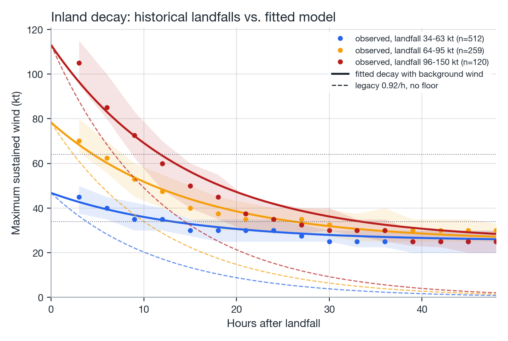

# Stochastic track generator

NatCat generates synthetic tropical cyclone tracks with an empirical Markov model calibrated
directly on the historical ATCF archive, rather than a physically forced model &#8212; a
statistical approach in the spirit of Vickery et al. (2000), simplified for this project's scope.

## State space

Historical tracks are discretized onto a 2&deg;&times;2&deg; latitude/longitude grid (configurable
via `grid_size`). Each historical track point is assigned a state:

\[
\text{state}(lat, lon) = \left(\left\lfloor \frac{lat}{g} \right\rfloor \cdot g,\ \left\lfloor \frac{lon}{g} \right\rfloor \cdot g\right), \quad g = \texttt{grid\_size}
\]

For every historical fix (except the first of each storm), the **transition** to the next fix is
recorded as a tuple:

\[
(\text{speed}, \text{heading}, \Delta v_{\max}, \Delta \text{RMW})
\]

grouped by the state of the *originating* cell. `build_state_table` builds this lookup once from
the fitted historical set.

## Track propagation

Starting from a genesis point, `step_track` advances the storm forward in fixed time steps
(`time_step_h`, default 3h):

1. Look up the storm's current grid cell.
2. Sample one transition tuple **uniformly at random** from the historical transitions observed
   for that cell.
3. Propagate position using the sampled `speed`/`heading` (great-circle kinematics).
4. Update intensity and size:
   - **Over land:** \(v_{\max}\) relaxes towards a background wind following the fitted
     `LandDecayModel` (see [Inland decay](#inland-decay) below), and
     \(\text{RMW} \leftarrow \text{RMW} \cdot 1.02^{\Delta t}\) (`land_rmw_growth`, broadening, in
     timestep units \(\Delta t\)).
   - **Over water:** \(v_{\max} \leftarrow v_{\max} + \Delta v_{\max}\),
     \(\text{RMW} \leftarrow \text{RMW} + \Delta \text{RMW}\) from the sampled transition.
   - **Coast crossing:** a step whose start or end point is over land is split by the fraction of
     the step spent over land, \(f \in \{0, 0.5, 1\}\) (0.5 when only one endpoint is on land): the
     land rule acts on \(f \cdot \Delta t\) hours and the sampled water deltas are scaled by
     \((1 - f)\) and added on top, so a single step never applies the full land rule and the full
     water delta to the same timestep.
   - Plausibility clipping, applied at every step regardless of land/water: \(0 \le v_{\max} \le
     185\) kt (`max_wind_kt`) and \(5 \le \text{RMW} \le 150\) nm (`min_rmw_nm`, `max_rmw_nm`).
     These caps keep the unbounded random walk of sampled deltas from drifting past the strongest
     storm on record or growing an implausibly large RMW over a long-lived synthetic storm; they
     apply only to the step-by-step walk &#8212; genesis intensity/RMW values (see below) are
     copied directly from the historical record and are never clipped.

### Inland decay

Over land a tropical cyclone loses its energy source and its wind decays towards a background
value rather than towards zero. Following Kaplan & DeMaria (1995), `LandDecayModel` fits

\[
v(t) = v_b + (v_0 - v_b)\, e^{-\alpha t}
\]

by least squares to every over-land fix within `max_hours` (default 48 h) of a landfall at or
above `min_landfall_wind_kt` (default 34 kt) in the historical tracks the catalog is fitted on,
with \(v_0\) the wind at landfall, \(v_b\) the background wind (`floor_kt`) and \(\alpha\) the
decay rate (`rate_per_h`). `SyntheticTCCatalog(land_decay=None)` (the default) fits this model in
`fit()` and exposes it as `catalog.land_decay`; passing a `LandDecayModel` instance uses it as
given, and a bare float such as `0.92` restores the legacy per-hour multiplicative rule with no
background wind (`LandDecayModel.from_rate`).

Fit on all 808 historical landfall segments (6,762 over-land fixes): decay rate 0.069/h
(e-folding time 14.4 h), background wind 25.3 kt, RMSE 8.7 kt. The old rule (multiply by 0.92 per
hour, no background wind, terminate at 15 kt) had RMSE 21 kt and a +19 kt bias &#8212; it made
synthetic storms lose hurricane strength inland three to four times faster than observed, with
remnants dying within about eight hours of landfall, while best tracks carry them for days.
Kaplan & DeMaria (1995) literature values for the Atlantic (0.095/h, 26.7 kt) give RMSE 9.5 kt on
this data &#8212; close to, but not as good as, the fit on the catalog's own historical tracks.

{ width="100%" }
*Figure: median observed wind (with inter-quartile band) after landfall by landfall-intensity
class, the fitted `LandDecayModel` curve, and the legacy 0.92/h rule for comparison.*

Validated over the contiguous US (per storm touching land):

| Metric | Historical | Old synthetic (0.92/h) | New synthetic (fitted) |
|---|---|---|---|
| Mean hours over land &ge; 64 kt | 2.8 | 0.8 | 2.1 |
| Mean hours over land &ge; 34 kt | 17.0 | 3.9 | 13.0 |
| Share of landfalling storms &gt;6 h inland at hurricane force | 14% | 3% | 12% |

### Termination rules

A track stops advancing when any of the following holds:

- \(v_{\max} < 15\) kt (`min_wind_kt`), or
- the current grid cell has no historical transitions on record, or
- elapsed time exceeds `max_hours` (default 720 h / 30 days), or
- the storm has spent `land_remnant_hours` (default 24 h) over land below `remnant_wind_kt`
  (default 34 kt) &#8212; an inland remnant that has decayed below tropical-storm strength causes
  no modelled damage and would otherwise run to `max_hours`.

## Genesis model

`GenesisModel` fits a Gaussian KDE to the (latitude, longitude) of every historical storm's first
fix. Synthetic genesis points are drawn by:

1. Resampling candidate points from the KDE.
2. **Rejecting samples over land** (`global_land_mask`) &#8212; tropical cyclones do not form over
   land.
3. Assigning initial intensity and RMW via **KNN(5)**: standardize (lat, lon), find the 5 nearest
   historical genesis points, and copy the intensity/RMW of one of them chosen **uniformly at
   random** &#8212; rather than an average, so the synthetic genesis distribution reproduces the
   discrete historical intensity values rather than smoothing them out.

{ width="100%" }
*Figure: historical Atlantic first-fix locations and the Gaussian KDE fitted to them, with land
areas masked out of the sampling domain.*

## Annual frequency

`PoissonFrequency` counts historical storms per year and fits \(\lambda\) as the historical mean
count. The number of storms in a synthetic year is drawn as \(\text{Poisson}(\lambda)\); requesting
`n_years` storms therefore samples one Poisson draw per synthetic year rather than a single global
count.

{ width="100%" }
*Figure: synthetic Atlantic tropical cyclone tracks produced by the fitted Markov walk.*

## Determinism

A single `numpy.random.Generator` (`self.rng = np.random.default_rng(seed)`) is threaded through
every sampling step &#8212; KDE resampling, land-rejection retries, KNN neighbor choice, transition
draws, and Poisson sampling &#8212; so a `SyntheticTCCatalog` with a fixed `seed` reproduces an
identical catalog on every run, with no reliance on global `numpy.random` state.

## References

- Vickery, P. J., Skerlj, P. F., & Twisdale, L. A. (2000). *Simulation of Hurricane Risk in the
  U.S. Using Empirical Track Model.* Journal of Structural Engineering, 126(10), 1222&#8211;1237.
- Emanuel, K., Ravela, S., Vivant, E., & Risi, C. (2006). *A Statistical Deterministic Approach to
  Hurricane Risk Assessment.* Bulletin of the American Meteorological Society, 87(3), 299&#8211;314.
- Kaplan, J., & DeMaria, M. (1995). *A Simple Empirical Model for Predicting the Decay of Tropical
  Cyclone Winds after Landfall.* Journal of Applied Meteorology, 34(11), 2499&#8211;2512.
- Grossi, P., & Kunreuther, H. (Eds.). (2005). *Catastrophe Modeling: A New Approach to Managing
  Risk.* Springer.
