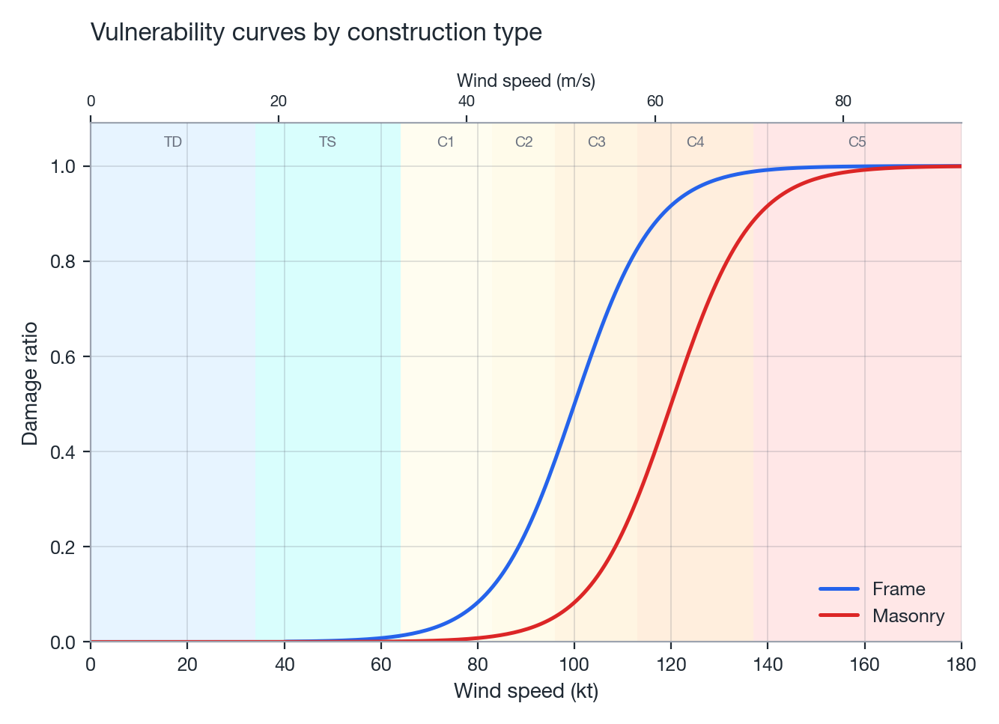

# Vulnerability

NatCat's wind vulnerability model converts hazard intensity (sustained wind speed) into a mean
damage ratio (MDR) using a sigmoid function, parameterized per construction type.

## Sigmoid damage function

\[
\text{MDR}(v) =
\begin{cases}
0, & v < v_{\text{threshold}} \\[4pt]
\dfrac{1}{1 + \exp\big(-k (v - v_{50})\big)}, & v \ge v_{\text{threshold}}
\end{cases}
\]

where \(v\) is wind speed (kt), \(v_{\text{threshold}}\) (default 40 kt) is the damage onset
threshold, \(v_{50}\) is the wind speed at which MDR = 0.5, and \(k\) controls the steepness of the
curve around \(v_{50}\).

## Construction parameters

| Construction | \(v_{50}\) (kt) | \(k\) | Interpretation |
|--------------|-----------------|-------|-----------------|
| Frame (wood) | 100 | 0.12 | Weaker envelope; reaches 50% MDR at a lower wind speed |
| Masonry | 120 | 0.12 | Stronger envelope; 50% MDR at a higher wind speed |

```python
from natcat.vulnerability import WindVulnerability

vuln = WindVulnerability("Frame")
# or, to override/extend the built-in table with a custom class:
# vuln = WindVulnerability("Custom", params={"Custom": {"v_50": 105, "k": 0.10}})
mdr = vuln.damage_ratio(intensity_kt, construction_types=None)
```

`construction_types` can be supplied per-asset (array-like, one value per location); if omitted,
the instance's default `construction_type` is used for every location. Requesting an unknown
construction type &#8212; whether via the constructor or per-asset &#8212; raises `ValueError`
listing the known types, rather than silently falling back to a default parameterization.

{ width="100%" }
*Figure: mean damage ratio vs. sustained wind speed for Frame and Masonry construction.*

## Scope and simplifications

This is a deliberately simple, uncalibrated engineering curve &#8212; not a fragility function
derived from claims data or structural analysis. It captures the qualitative shape expected of
wind damage (a threshold, then a smooth S-curve saturating at total loss) and the ordinal
relationship between construction classes, but see
[Limitations & validation](limitations.md) for what it does not capture (duration, gust factors,
building age/code era, secondary perils).

## References

- Vulnerability/fragility curve conventions follow the general cat-modelling approach described in
  Grossi, P., & Kunreuther, H. (Eds.). (2005). *Catastrophe Modeling: A New Approach to Managing
  Risk.* Springer.
