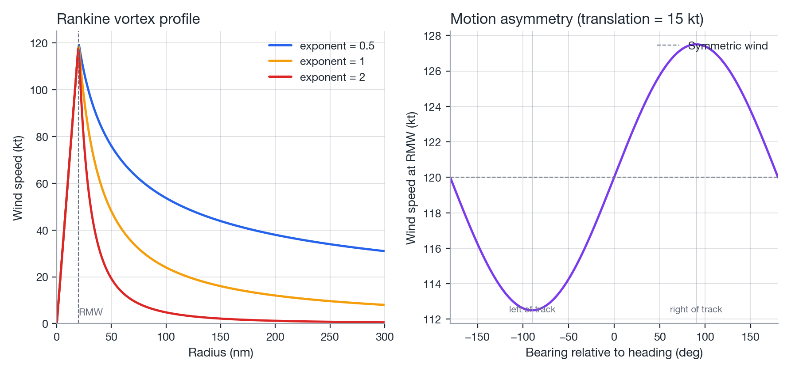
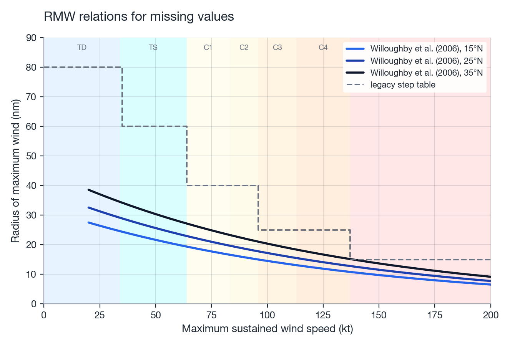

# Wind field

NatCat's hazard model is a parametric Rankine vortex with a storm-motion asymmetry correction,
evaluated over the full track to produce a maximum-wind footprint.

## Rankine vortex

The classical Rankine vortex (Rankine, in the fluid-dynamics literature; applied to tropical
cyclones since at least the mid-20th century) models the tangential wind speed \(v\) at radius
\(r\) from the storm center as solid-body rotation inside the radius of maximum wind (RMW,
\(R\)) and a power-law decay outside it:

\[
v(r) =
\begin{cases}
v_{\max} \cdot \dfrac{r}{R}, & r < R \\[4pt]
v_{\max} \cdot \left(\dfrac{R}{r}\right)^{n}, & r \ge R
\end{cases}
\]

where \(v_{\max}\) is the maximum sustained wind speed (kt) and \(n\) is the **decay exponent**.

| Exponent \(n\) | Interpretation |
|----------------|-----------------|
| \(n = 1\) | Classical Rankine vortex |
| \(n = 0.5\) (**NatCat default**) | "Modified Rankine" &#8212; commonly fitted to observed TC wind profiles (e.g. Holland 1980 and subsequent parametric-profile literature) |
| \(n = 2\) | Steeper-than-physical decay; NatCat's default before calibration |

```python
from natcat.hazards.wind_field import rankine_vortex

v = rankine_vortex(r, vmax=100.0, rmw=25.0, exponent=0.5)
```

!!! info "The decay exponent and asymmetry factor are calibrated defaults"
    `DEFAULT_DECAY_EXPONENT = 0.5` and `DEFAULT_ASYMMETRY_FACTOR = 0.3` are not arbitrary: they are
    the winning point of the hazard grid in
    [Calibration](calibration.md#hazard-parameter-grid), which recomputed the wind footprint of 19
    US landfalls (1989&#8211;2020) at every combination of exponent &isin;
    {0.5, 0.75, 1.0, 1.5, 2.0} and asymmetry &isin; {0.3, 0.5, 0.7} and calibrated the vulnerability
    at each point. Lower exponents were consistently better across the whole grid (1.77x&#8211;2.08x
    typical factor error), and 0.5/0.3 &#8212; conveniently also the textbook "modified Rankine" value
    &#8212; won outright. The pre-calibration defaults were `exponent=2.0` and `factor=0.5`; both are
    still available by passing them explicitly. `exponent` is exposed on `rankine_vortex`,
    `max_wind_footprint`, and as `TropicalCycloneHazard(..., decay_exponent=...)`.

{ width="100%" }
*Figure: tangential wind speed vs. radius for `exponent` &isin; {0.5, 1.0, 2.0}, same \(v_{\max}\), \(R\).*

## Motion asymmetry

A moving storm is not azimuthally symmetric: the side of the storm where the vortex rotation and
the storm's translation add constructively ("right of track" in the Northern Hemisphere, for a
cyclonic/counterclockwise vortex) is stronger than the side where they oppose. NatCat adds a
first-order correction:

\[
v_{\text{total}} = v_{\text{sym}} + f \cdot v_{t} \cdot \sin(\Delta\theta)
\]

\[
\Delta\theta = \big[(\theta_{\text{point}} - \theta_{\text{heading}} + 180) \bmod 360\big] - 180
\]

where \(v_{\text{sym}}\) is the symmetric Rankine wind speed, \(v_t\) is the translation speed,
\(\theta_{\text{point}}\) is the bearing from the storm center to the location of interest,
\(\theta_{\text{heading}}\) is the storm's heading, and \(f\) is the **asymmetry factor**
(`DEFAULT_ASYMMETRY_FACTOR = 0.3`, the calibrated value; the pre-calibration default was 0.5).
\(\Delta\theta\) is wrapped to \((-180^\circ, 180^\circ]\) so that positive values are to the right
of the track (positive contribution) and negative values to the left.

```python
from natcat.hazards.wind_field import motion_asymmetry

v_total = v_sym + motion_asymmetry(bearing_to_point, heading, translation_speed, factor=0.3)
```

## Radius of maximum wind (RMW)

Best tracks before about 2005 carry no observed RMW at all, and even later fixes have frequent
gaps, so `fill_missing_rmw` has to substitute *something* for a large share of every track. The
default, `method="willoughby"`, uses the empirical fit of Willoughby, Darling & Rahn (2006), eq. 7a:

\[
R_{\max}\ [\text{km}] = 46.4 \cdot \exp\big(-0.0155\, v_{\max}\ [\text{m/s}] + 0.0169\, |\phi|\big)
\]

with \(v_{\max}\) the maximum sustained wind and \(\phi\) the latitude in degrees: stronger storms
have tighter cores, and storms at higher latitude are broader for the same intensity. It replaces
the coarse intensity-class step table this package used previously (`method="step"`, still
available), which assigned every Category 4+ storm a flat 25 nm RMW regardless of how compact it
actually was &#8212; Hurricane Michael's observed RMW at landfall was 6&#8211;10 nm, so the step table
overstated it by roughly 2.5&#8211;4x and, because the Rankine core scales the whole footprint,
concentrated far too little wind (and far too much loss) near the eyewall. If `storm_type == "EX"`
(extratropical), the resulting RMW &#8212; from either method &#8212; is multiplied by 1.5, since
extratropical transition broadens the wind field even as peak winds weaken.

{ width="100%" }
*Figure: RMW (nm) vs. maximum sustained wind speed (kt) &#8212; the Willoughby relation at 15/25/35&deg;N
against the legacy step table (dashed).*

## Footprint computation

`max_wind_footprint(track, coords, *, vortex="rankine", asymmetry_factor=DEFAULT_ASYMMETRY_FACTOR, exponent=DEFAULT_DECAY_EXPONENT, chunk_size=200_000)`
evaluates the wind field at every combination of track point and target coordinate and reduces to
the running maximum per location:

\[
\text{footprint}_j = \max_{i \in \text{track}} v_{\text{total}}(i, j)
\]

This is computed as a single vectorised `(T, N)` broadcast in `chunk_size`-bounded blocks (never a
Python loop over track points), and `max_wind_history` extends this to a full `(T, N)` array of
cumulative running maxima via `numpy.maximum.accumulate` &#8212; one pass over the track regardless
of how many timestamps are later sampled from it. `TropicalCycloneHazard.compute_intensity_history`
uses exactly this to support time-evolving loss without recomputing the footprint at every step.

## Temporal sampling

Because the footprint is a maximum over discrete track positions, the track has to be sampled
finely enough that every location near the track is visited by the eyewall. Between two centres a
distance \(d\) apart, a point on the track line is at best \(d/2\) from the nearest centre;
with \(d > 2\,R_{\max}\) it never sees \(V_{\max}\) and the swath degenerates into a string of
discs. The step must therefore satisfy

\[
\Delta t \ll \frac{R_{\max}}{c}
\]

with \(c\) the translation speed. For a compact hurricane (\(R_{\max} = 10\) nm, \(c = 15\) kt)
that is well under 40 minutes; at a 1-hour step Hurricane Michael's modelled loss on the Florida
LitPop portfolio drops by half. `prepare_track`/`load_best_track` therefore default to
`DEFAULT_TRACK_FREQ = "5min"`. The stochastic `LossSimulator` interpolates synthetic tracks at its
own `freq`; its default trades some of this accuracy for run time on thousands of storms.

## References

- Rankine vortex &#8212; classical fluid-dynamics idealization, applied to tropical cyclone wind
  fields throughout the parametric-model literature.
- Holland, G. J. (1980). *An Analytic Model of the Wind and Pressure Profiles in Hurricanes.*
  Monthly Weather Review, 108(8), 1212&#8211;1218.
- Willoughby, H. E., Darling, R. W. R., & Rahn, M. E. (2006). *Parametric Representation of the
  Primary Hurricane Vortex. Part II: A New Family of Sectionally Continuous Profiles.* Monthly
  Weather Review, 134(4), 1102&#8211;1120.
