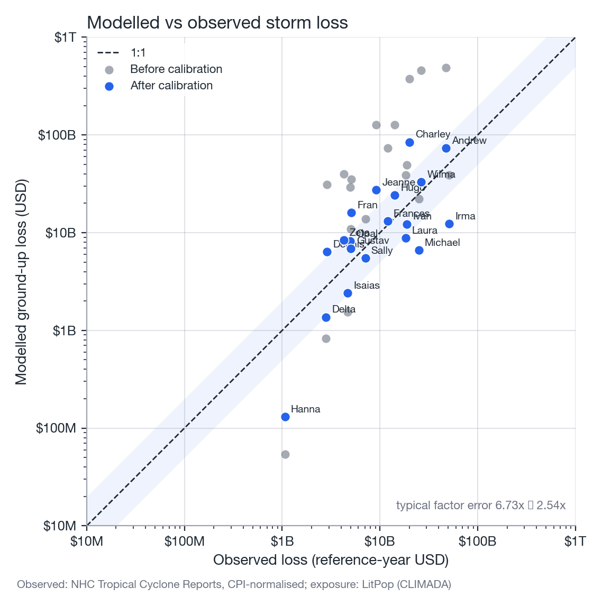
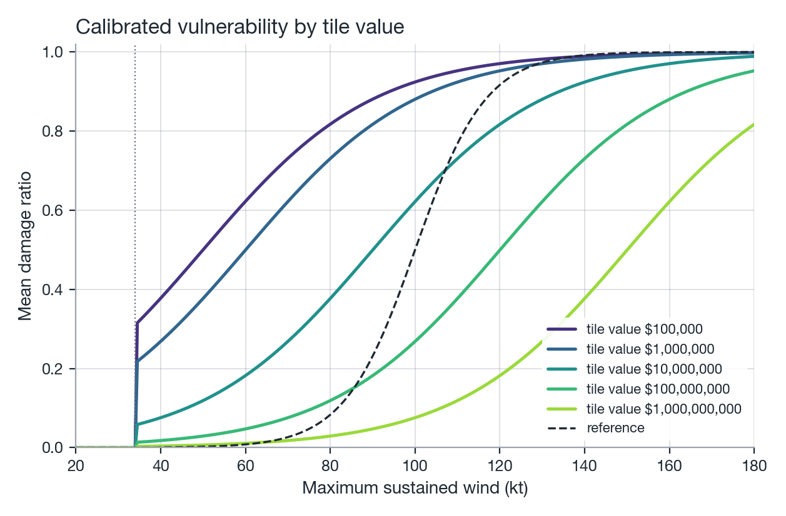

# Calibration

`natcat.calibration` fits a vulnerability model's parameters against observed storm losses:
load an observed-loss table, precompute one wind footprint per storm on its regional exposure, and
minimise a log-ratio objective with `Calibrator`. The result is a `VulnerabilityModel` you can drop
straight into `LossCalculator` or `LossSimulator` in place of `WindVulnerability`.

```python
from natcat.calibration import Calibrator, build_cases, load_observed_losses, normalise_losses
from natcat.vulnerability import ValueDependentVulnerability

observed = normalise_losses(load_observed_losses(), reference_year=2018)
cases = build_cases(observed)                      # footprint per storm, once
result = Calibrator(cases, ValueDependentVulnerability()).fit(seed=0)
print(result.summary())
```

See [Calibration methodology](../methodology/calibration.md) for the value-dependent vulnerability
model, the objective function and, importantly, the caveats around the bundled observed-loss data.

## Observed losses

`load_observed_losses` reads the bundled NHC US-landfall table by default, or a CSV of your own
via `path=`. Every table needs `REQUIRED_COLUMNS`:

`storm_id`, `name`, `year`, `basin`, `storm_number`, `observed_loss_usd`, `loss_year`

and accepts these optional columns:

| Column | Meaning |
|---|---|
| `damage_driver` | `wind` / `mixed` / `surge` / `flood` &#8212; informational, not used by the loader |
| `include` | Drop the row when `included_only=True` (the default). Storms whose damage is dominated by surge or rainfall flooding are marked `False` in the bundled table because the model is wind-only. |
| `normalisation_factor` | Overrides the CPI factor `normalise_losses` would otherwise compute |
| `weight` | Objective weight for this storm (default 1); see [the objective](../methodology/calibration.md#objective-function) |
| `source`, `notes` | Free text, carried through unused |

```python
from natcat.calibration import load_observed_losses, normalise_losses

observed = load_observed_losses()                    # bundled NHC US-landfall table
observed = normalise_losses(observed, reference_year=2018)   # + normalisation_factor, observed_loss_ref_usd
```

`normalise_losses` brings every storm's `observed_loss_usd` (nominal USD of `loss_year`) to the
price level of `reference_year` &#8212; the year LitPop's exposure values refer to &#8212; by
scaling with the ratio of US CPI-U annual averages (`method="cpi"`, the default) or leaving the
loss unchanged (`method="none"`). It adds `normalisation_factor` and `observed_loss_ref_usd`, and
never mutates its input. Passing your own `path` to `load_observed_losses` lets you calibrate
against insured losses, a different country, or a different storm set, as long as the CSV carries
the required columns.

!!! warning "The bundled table is a starting point, not an authoritative loss database"
    Check the cited NHC Tropical Cyclone Reports before using a calibration built on it for
    anything beyond exploration, and prefer your own (e.g. insured) losses where available.

## Building cases

A storm's wind footprint does not depend on the vulnerability parameters, so `build_cases`
computes it once per storm and stores it together with the exposure values it was evaluated on
&#8212; a `StormCase` per row of the observed table:

```python
cases = build_cases(observed)
```

For each row, `build_cases`:

1. Loads the best track (`natcat.tracks.load_best_track`).
2. Derives an exposure box around the part of the track over land (`storm_region`, `margin_deg=2.0`
   padding, clipped to `CONUS_BOUNDS` by default).
3. Loads the regional exposure for that box &#8212; LitPop USA by default (`load_litpop_exposure`),
   overridable via `exposure_loader=lambda bounds: ...` for a different country or your own
   portfolio.
4. Evaluates the wind footprint on the exposure locations (`hazard_factory`, default
   `TropicalCycloneHazard`) and stores `intensity`, `tiv`, `construction` (if present) and the
   storm's `observed_loss_ref_usd` on the `StormCase`.

Storms whose track never reaches the land bounds, or whose exposure box is empty, are skipped with
a logged warning rather than raising. `StormCase.loss(vulnerability)` re-evaluates the portfolio
loss for any `VulnerabilityModel` in one vectorised pass, which is what makes an optimiser with
hundreds of evaluations run in seconds &#8212; downloading tracks and building the LitPop exposure
is the slow part, and it only happens once.

Cache the built cases so repeated calibration runs skip the download/exposure step entirely:

```python
from pathlib import Path
from natcat.calibration import load_cases, save_cases

cases_path = Path(".cache/calibration_cases.pkl")
if cases_path.exists():
    cases = load_cases(cases_path)
else:
    cases = build_cases(observed)
    save_cases(cases, cases_path)
```

`save_cases`/`load_cases` are a plain pickle round-trip; delete the file to force a rebuild (e.g.
after changing `margin_deg`, the exposure loader, or the observed-loss table).

## Fitting with `Calibrator`

```python
from natcat.calibration import Calibrator
from natcat.vulnerability import ValueDependentVulnerability

calibrator = Calibrator(cases, ValueDependentVulnerability())
result = calibrator.fit(method="global", maxiter=200, seed=0)
```

`Calibrator(cases, model, *, param_names=None, bounds=None)` optimises `model.params` &#8212; any
`VulnerabilityModel` that implements `params` (a flat `dict[str, float]`) and `with_params(**updates)`
works, not just `ValueDependentVulnerability`. `param_names` restricts the fit to a subset of
`model.params`, keeping the rest fixed at their starting value; `bounds` overrides the per-parameter
`(lo, hi)` range, which otherwise defaults to the model's `DEFAULT_BOUNDS` where available (both
`ValueDependentVulnerability` and `WindVulnerability` define one) or `(0.1x, 10x)` of the starting
value.

`fit(*, method="global", maxiter=200, seed=None, polish=True)`:

- `method="global"` runs `scipy.optimize.differential_evolution` within `bounds`, then (if
  `polish=True`) a bounded Nelder-Mead polish from the global result &#8212; the recommended default,
  since the objective is not convex in the logistic parameters.
- `method="local"` runs bounded Nelder-Mead directly from the model's current parameter values;
  useful for a quick re-fit after nudging one parameter by hand, or for fitting a subset of
  `param_names` around an already-reasonable starting point.

The optimiser never returns a result worse than the starting model: if it fails to improve on the
initial objective, `fit` keeps the starting parameters and logs a warning.

## `CalibrationResult`

| Attribute | Type | Description |
|---|---|---|
| `model` | `VulnerabilityModel` | Calibrated model |
| `initial_model` | `VulnerabilityModel` | Model the calibration started from |
| `params` / `initial_params` | `dict[str, float]` | Parameter values after / before |
| `objective` / `initial_objective` | `float` | Weighted mean squared log10 ratio after / before |
| `table` | `pd.DataFrame` | Per-storm `observed`, `modelled_initial`, `modelled` (USD) and `log_ratio_initial` / `log_ratio` |
| `n_evaluations` | `int` | Objective evaluations used by the optimiser |
| `method`, `message` | `str` | Optimiser used, optimiser status message |
| `rmse_log10` | `float` (property) | `sqrt(objective)`; typical factor error is `10 ** rmse_log10` |

```python
print(result.summary())
result.table
print(f"typical factor error: {10 ** result.rmse_log10:.2f}x")
```

`summary()` prints a multi-line before/after report of every calibrated parameter plus the
objective and its implied "typical factor error" (`10 ** sqrt(objective)`) &#8212; a $25 B storm
modelled at $50 B and a $1 B storm modelled at $2 B both contribute a factor of 2 to this number.

## Plotting

```python
from natcat import plotting
from natcat.vulnerability import WindVulnerability

plotting.apply_style()
fig, ax = plotting.plot_calibration(result, title="Modelled vs observed storm loss")
fig, ax = plotting.plot_value_dependent_curves(
    result.model, reference=WindVulnerability("Frame"), title="Calibrated vulnerability by tile value"
)
```

`plot_calibration` draws modelled versus observed loss per storm on a log-log scatter, with the 1:1
line, a shaded `band_factor`-wide band around it, the pre-calibration points in grey
(`show_initial=True`) and per-storm name labels (`label_storms=True`).

{ width="100%" }
*Figure: scatter of modelled against observed loss for the calibration set, on a log-log scale.*

`plot_value_dependent_curves` draws the damage-ratio curve of a `ValueDependentVulnerability` for
several tile values (`tivs`, default `1e5` to `1e9`), optionally against a dashed `reference` curve
such as the uncalibrated `WindVulnerability("Frame")`.

{ width="100%" }
*Figure: mean damage ratio vs. wind speed for several LitPop tile values, calibrated model in
colour, uncalibrated `WindVulnerability("Frame")` dashed.*

## Using the calibrated model

`result.model` is a plain `VulnerabilityModel`, so it drops into `LossCalculator` and
`LossSimulator` exactly like `WindVulnerability`:

```python
from natcat.exposure import load_litpop_exposure
from natcat.hazards import TropicalCycloneHazard
from natcat.loss import LossCalculator
from natcat.tracks import load_best_track

track = load_best_track(2018, "al", "14")
portfolio = load_litpop_exposure("USA", bounds=(24.5, 32.0, -87.6, -80.0))

calc = LossCalculator(TropicalCycloneHazard(track), result.model)
calc.compute(portfolio)
print(f"Calibrated ground-up loss: ${calc.total_loss:,.0f}")
```

```python
from natcat.loss import LossSimulator

simulator = LossSimulator(catalog, portfolio, result.model, seed=42)
results = simulator.run(n_years=1000)
```

Because `ValueDependentVulnerability.damage_ratio` reads the `tiv` keyword, `LossCalculator` and
`LossSimulator` (which always pass `tiv=` through) automatically vary the damage ratio by tile
value &#8212; no other change to the pipeline is needed.

## Reference

| Signature | Returns |
|-----------|---------|
| `load_observed_losses(path=None, *, included_only=True)` | `pd.DataFrame` |
| `normalise_losses(df, *, reference_year=2018, method="cpi")` | `pd.DataFrame` |
| `build_cases(observed, *, exposure_loader=None, hazard_factory=TropicalCycloneHazard, margin_deg=2.0, loss_column="observed_loss_ref_usd", data_dir=None, download=True, progress=True)` | `list[StormCase]` |
| `save_cases(cases, path)` / `load_cases(path)` | `None` / `list[StormCase]` (pickle round-trip) |
| `storm_region(track, *, margin_deg=2.0, land_bounds=CONUS_BOUNDS)` | `(lat_min, lat_max, lon_min, lon_max)` |
| `Calibrator(cases, model, *, param_names=None, bounds=None)` | calibrator instance |
| `calibrator.fit(*, method="global", maxiter=200, seed=None, polish=True)` | `CalibrationResult` |
| `calibrator.modelled_losses(model=None)` | `NDArray`, per-case USD |
| `calibrator.table(model)` | `pd.DataFrame` |
| `ValueDependentVulnerability(*, threshold_kt=40.0, v50_ref=105.0, v50_slope=0.0, k=0.12, scale=1.0, tiv_ref=1e7, v50_bounds=(50.0, 250.0))` | model instance |
| `plotting.plot_calibration(result, *, ax=None, show_initial=True, label_storms=True, band_factor=2.0, title=None)` | `(fig, ax)` |
| `plotting.plot_value_dependent_curves(model, *, tivs=(1e5,...,1e9), reference=None, ax=None, title=None)` | `(fig, ax)` |

See the full [API reference](../api/calibration.md) for parameter and type details.
