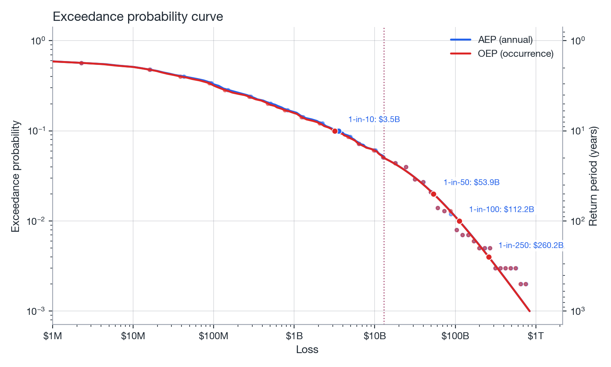

# Financial metrics

Turn a simulated annual loss distribution into the exceedance-probability curves, return periods
and average annual loss used to price and structure catastrophe risk.

## From simulation results

```python
from natcat.financial import ExceedanceProbability

ep = ExceedanceProbability.from_simulation(results, tail_quantile=0.95)
```

or directly from arrays:

```python
ep = ExceedanceProbability(
    annual_losses=results.annual_losses,
    max_event_losses=results.max_event_losses,
    tail_quantile=0.95,
)
```

`annual_losses` drives **AEP** (annual exceedance probability); `max_event_losses` drives **OEP**
(occurrence exceedance probability). Below the `tail_quantile` (95th percentile by default) both
use the empirical estimator; above it, a generalized Pareto distribution (GPD) fit to the excess
losses extrapolates the tail. See [Exceedance probability](../methodology/exceedance-probability.md)
for the full derivation.

## AEP vs. OEP

| Metric | Answers | Built from |
|--------|---------|------------|
| **AEP** &#8212; Annual Exceedance Probability | Probability that *total* losses in a year exceed `x` | `annual_losses` (sum of all events in the year) |
| **OEP** &#8212; Occurrence Exceedance Probability | Probability that the *single largest* event in a year exceeds `x` | `max_event_losses` (max single event per year) |

AEP is the standard metric for whole-portfolio risk (aggregate reinsurance, capital); OEP is the
standard metric for per-occurrence risk (per-event reinsurance layers).

## Querying the curve

```python
import numpy as np

losses = np.array([1e7, 5e7, 1e8, 5e8, 1e9])

p_aep = ep.aep(losses)                       # vectorised: annual exceedance probability
p_oep = ep.oep(losses)                       # vectorised: occurrence exceedance probability

rp_aep = ep.return_period(losses, kind="aep")   # years
rp_oep = ep.return_period(losses, kind="oep")

loss_100y = ep.loss_at_return_period(100, kind="oep")   # inverse: loss at the 1-in-100-year OEP level

curve = ep.curve(kind="aep", n_points=200)   # DataFrame [loss, probability, return_period]

print(f"AAL: ${ep.aal:,.0f}")
shape, loc, scale, threshold = ep.tail_fit(kind="aep")
```

`aep`/`oep` and `return_period` are fully vectorised over the input loss array. `curve` returns a
tidy DataFrame ready for plotting or export; `loss_at_return_period` inverts the curve via
interpolation to answer "what loss corresponds to the 1-in-`rp`-year event?" &#8212; the quantity
typically used to size a reinsurance attachment point.

{ width="100%" }
*Figure: empirical exceedance probability below the 95th percentile, GPD tail above it.*

!!! tip "Return period = 1 / EP"
    `return_period(loss, kind)` is simply `1 / ep.aep(loss)` (or `oep`), floored at the number of
    simulated years' worth of resolution the empirical estimator can support; the GPD tail is what
    lets the curve extend meaningfully beyond that empirical limit (e.g. 250-year, 500-year return
    periods from a 1,000-year simulation).

## Plotting

```python
from natcat import plotting

plotting.plot_ep_curve(ep, kinds=("aep",))
plotting.plot_annual_loss_distribution(results.annual_losses)
```

## Reference

| Signature | Returns |
|-----------|---------|
| `ExceedanceProbability(annual_losses, max_event_losses=None, *, tail_quantile=0.95)` | instance |
| `ExceedanceProbability.from_simulation(results, **kw)` | instance (classmethod) |
| `ep.aep(loss)` / `ep.oep(loss)` | `NDArray`, vectorised probability |
| `ep.aep_empirical(loss)` / `ep.oep_empirical(loss)` | `NDArray`, empirical-only estimator |
| `ep.return_period(loss, kind="aep"\|"oep")` | `NDArray`, years |
| `ep.loss_at_return_period(rp, kind="aep"\|"oep")` | `NDArray`, USD (interpolated inverse) |
| `ep.curve(kind="aep", n_points=200)` | `pd.DataFrame [loss, probability, return_period]` |
| `ep.aal` | `float` |
| `ep.tail_fit(kind)` | `(shape, loc, scale, threshold)` |

See the full [API reference](../api/financial.md) for parameter and type details.
