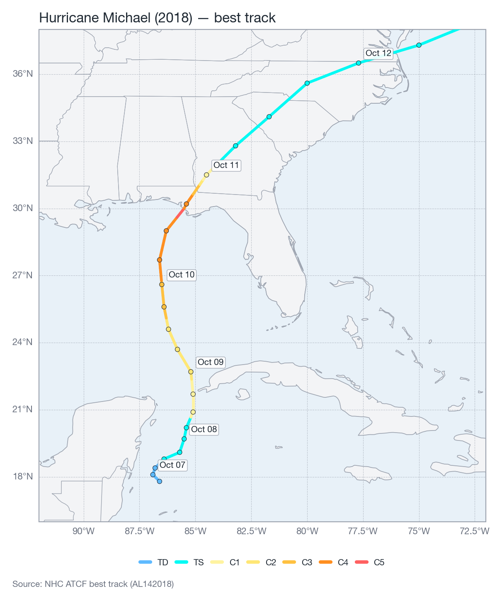

# Single-event loss

Compute the ground-up loss a single historical or forecast track causes on a portfolio, including
its full spatial and temporal evolution.

## Load and prepare a track

```python
from natcat.tracks import load_best_track

track = load_best_track(2018, "al", "14", freq="1h")
```

`load_best_track` downloads (if needed), reads, and runs the full `prepare_track` pipeline:
de-duplicate &rarr; `fill_missing_rmw` &rarr; `interpolate_track` &rarr; `add_translation_velocity`
&rarr; `add_heading`. The result matches the [processed track](data-model.md#processed-track)
schema. `freq` controls the interpolation step (default `"1h"`); a finer step gives a smoother
wind field at the cost of more points.

{ width="100%" }
*Figure: OFCL best track for Hurricane Michael (2018), colored by Saffir&#8211;Simpson category.*

## Build the hazard

```python
from natcat.hazards import TropicalCycloneHazard

hazard = TropicalCycloneHazard(track, vortex="rankine", asymmetry_factor=0.5)
```

`compute_intensity(coords)` returns the maximum wind speed (kt) experienced at each coordinate
over the entire track &#8212; the standard footprint used for a single ground-up loss estimate.

```python
import numpy as np

coords = np.column_stack([portfolio["latitude"], portfolio["longitude"]])
footprint = hazard.compute_intensity(coords)   # shape (N,)
```

{ width="100%" }
*Figure: gridded maximum wind footprint (kt) from the Rankine vortex wind field.*

!!! tip "Decay exponent"
    `TropicalCycloneHazard(..., decay_exponent=2.0)` controls how fast wind speed decays outside
    the radius of maximum wind (RMW). See [Wind field](../methodology/wind-field.md) for the
    physical interpretation of this parameter and why 2.0 is kept as the package default.

## Apply vulnerability and compute loss

```python
from natcat.vulnerability import WindVulnerability
from natcat.loss import LossCalculator

vulnerability = WindVulnerability("Frame")   # or pass construction_types per-asset to compute()
calculator = LossCalculator(hazard, vulnerability)

result = calculator.compute(portfolio)
print(calculator.total_loss)
```

`result` adds `intensity`, `damage_ratio` and `loss` to the portfolio columns (see
[Data model](data-model.md#loss-result)). `calculator.total_loss` sums `loss` across the
portfolio; it raises `RuntimeError` if `compute` has not been called yet.

## Time-evolving loss

To animate or inspect how damage accumulates as the storm passes &#8212; e.g. the Hurricane Michael
example on the [project README](https://github.com/christianwirths/NatCat) &#8212; use
`compute_history` with a series of timestamps:

```python
import pandas as pd

times = pd.date_range(track["time"].min(), track["time"].max(), freq="30min")
history = calculator.compute_history(portfolio, times)
```

`history` is long-format: portfolio columns + `intensity`, `damage_ratio`, `loss`, `time`, with one
block of rows per timestamp. Internally this uses
`TropicalCycloneHazard.compute_intensity_history`, which computes the wind field **once** as a
cumulative running maximum over time (`numpy.maximum.accumulate`) rather than recomputing the
whole footprint at every timestamp &#8212; an important performance fix over the original
implementation, which was quadratic in the number of track points.

```python
from natcat import plotting

extent = (-87.5, -83.5, 28.0, 31.5)  # (lon_min, lon_max, lat_min, lat_max)
plotting.animate_footprint(history, track=track, portfolio=portfolio, extent=extent)
```

{ width="100%" }
*Figure: spatial damage-ratio evolution as the best-track wind field sweeps across the portfolio.*

## Reference

| Signature | Returns |
|-----------|---------|
| `TropicalCycloneHazard(track, *, vortex="rankine", asymmetry_factor=0.5)` | hazard instance |
| `hazard.compute_intensity(coords)` | `(N,)` max wind speed (kt) |
| `hazard.compute_intensity_history(coords, times)` | `(T, N)` cumulative running max at each time |
| `LossCalculator(hazard, vulnerability)` | calculator instance |
| `calculator.compute(portfolio)` | loss DataFrame; sets `.results` |
| `calculator.compute_history(portfolio, times)` | long-format loss DataFrame with `time` |
| `calculator.total_loss` | `float`; raises `RuntimeError` before `compute()` |

See the full [API reference](../api/hazards.md) for parameter and type details.
