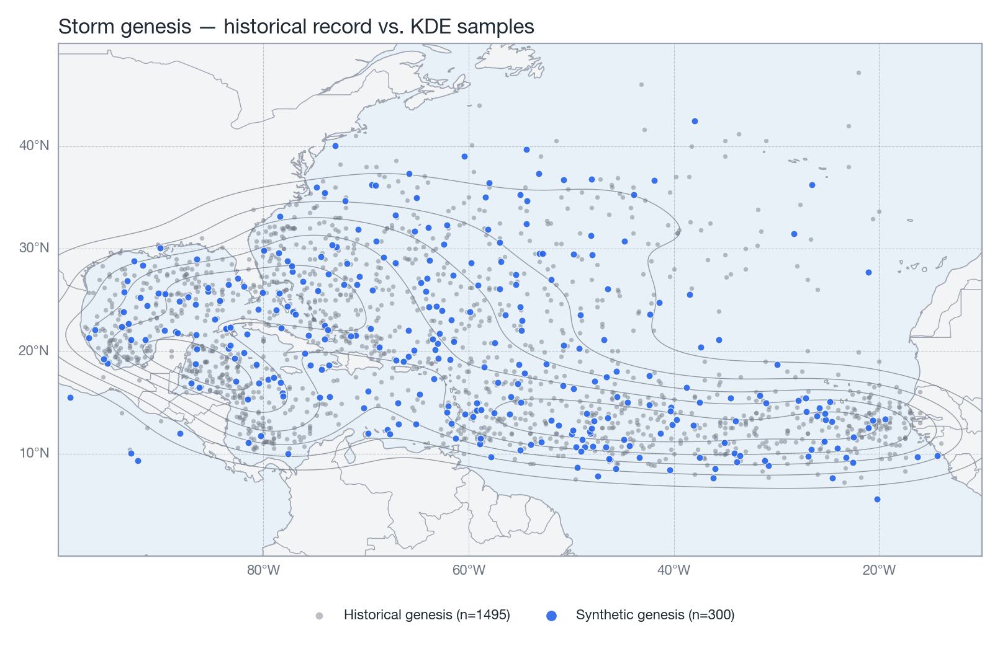
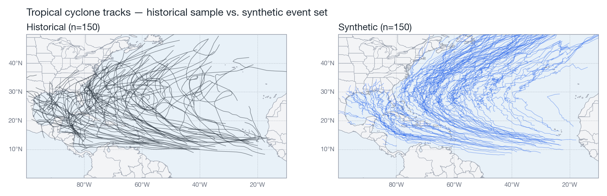
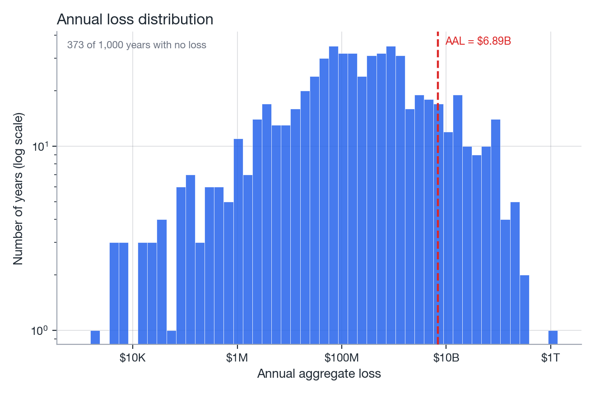

# Stochastic event set

Calibrate the empirical Markov track model on the historical archive and generate a synthetic
tropical-cyclone catalog for many simulated years.

## Fit the catalog on historical tracks

```python
from natcat.stochastic import SyntheticTCCatalog

catalog = SyntheticTCCatalog(
    basin="al",
    grid_size=2.0,
    time_step_h=3.0,
    max_hours=720,
    n_neighbors=5,
    min_wind_kt=15.0,
    land_decay=0.92,
    land_rmw_growth=1.02,
    max_wind_kt=185.0,
    max_rmw_nm=150.0,
    seed=42,
)
catalog.fit("data/raw")   # loads every b<basin>*.dat via read_best_track + prepare_track(freq="3h")
```

`fit` builds three sub-models from the historical set (exposed as attributes for inspection):

- `catalog.genesis` &#8212; a `GenesisModel`: KDE over historical genesis (first-fix) points, with
  land rejection and KNN(5) intensity/RMW assignment.
- `catalog.transitions` &#8212; a `TransitionModel`: the empirical Markov transition table, keyed by
  2&deg;&times;2&deg; grid cell.
- `catalog.frequency` &#8212; a `PoissonFrequency`: storms/year calibrated to the historical mean.

{ width="100%" }
*Figure: historical Atlantic genesis locations (1900&#8211;2020) used to fit the genesis KDE.*

!!! warning "One RNG for everything"
    `SyntheticTCCatalog(seed=...)` creates a single `numpy.random.Generator`
    (`self.rng = np.random.default_rng(seed)`) that is threaded through genesis sampling, KNN
    neighbor selection, transition draws and Poisson frequency sampling. No global `np.random`
    calls are made anywhere in the stochastic module, so a given seed reproduces the exact same
    catalog run to run.

## Generate a synthetic catalog

```python
# Either a fixed number of storms...
events = catalog.generate(n_storms=5000)

# ...or a number of synthetic years (storm count sampled from the fitted Poisson rate)
events = catalog.generate(n_years=1000)
```

`generate` returns a single DataFrame with columns `storm_id`, `year` (if `n_years` was given),
`time`, `latitude`, `longitude`, `max_wind_speed_kt`, `radius_max_wind_nm`,
`translation_speed_kt`, `heading_deg`, `hour`. Requesting `n_storms=0` (or a Poisson draw of 0 for
a given year) returns an empty DataFrame with the correct columns rather than raising.

{ width="100%" }
*Figure: synthetic Atlantic tracks generated by the empirical Markov walk.*

## Simulate losses over many years

`natcat.loss.LossSimulator` drives the catalog against a portfolio, one simulated year at a time,
and collects the results.

```python
from natcat.exposure import synthetic_portfolio
from natcat.vulnerability import WindVulnerability
from natcat.loss import LossSimulator

portfolio = synthetic_portfolio(n=500, bounds=(28.0, 31.5, -87.5, -83.5), seed=1)
vulnerability = WindVulnerability("Frame")

simulator = LossSimulator(catalog, portfolio, vulnerability, buffer_deg=5.0, seed=7)
results = simulator.run(n_years=1000, progress=True)
```

`buffer_deg` pads the portfolio's bounding box; only synthetic storms whose track passes within
that buffer are processed through the (comparatively expensive) hazard/loss pipeline &#8212; the
rest are skipped without ever building a `TropicalCycloneHazard` for them.

`freq` is the time step the 3-hourly synthetic tracks are interpolated to before the wind field is
evaluated. Because the footprint is a maximum over discrete track positions, a coarse step
under-samples compact storms and biases losses low (see
[Wind field: temporal sampling](../methodology/wind-field.md#temporal-sampling)). On the Florida
LitPop portfolio, 50 simulated years with the same seed give:

| `freq` | AAL | second-largest annual loss | run time |
|---|---|---|---|
| `"1h"` | $3.8 B | $41 B | 1x |
| `"15min"` | $4.6 B | $56 B | 3x |
| `"5min"` (default) | $4.9 B | $62 B | 8x |

Use `freq="1h"` for quick exploration and the default for any number you intend to quote.

`truncate_after_hurricane` (default `True`) cuts each synthetic track after its last fix at or
above 64 kt before the wind field is evaluated, the same rule `prepare_track` applies to best
tracks. Synthetic storms that never reach hurricane strength are evaluated in full.

## `SimulationResults`

| Attribute | Type | Description |
|-----------|------|--------------|
| `annual_losses` | `NDArray (n_years,)` | Aggregate loss per simulated year |
| `max_event_losses` | `NDArray (n_years,)` | Largest single-event loss per year (0 if none hit the portfolio) |
| `events` | `pd.DataFrame` | Columns `year`, `storm_id`, `loss` &#8212; one row per event that reached the portfolio |
| `tracks` | `dict[(year, storm_id)] -> DataFrame` | Processed track for every storm that reached the portfolio |
| `n_years` | `int` | Number of simulated years |
| `aal` | `float` | Average annual loss across `annual_losses` |
| `to_frame()` | `pd.DataFrame` | Tabular view of per-year results |

```python
print(f"AAL: ${results.aal:,.0f}")
print(f"Years with a loss: {(results.annual_losses > 0).mean():.1%}")
```

{ width="100%" }
*Figure: histogram of `annual_losses` across 1,000 simulated years.*

Continue to [Financial metrics](financial-metrics.md) to turn `SimulationResults` into AEP/OEP
curves, return periods and AAL.

## Reference

| Signature | Returns |
|-----------|---------|
| `SyntheticTCCatalog(*, basin="al", grid_size=2.0, time_step_h=3.0, max_hours=720, n_neighbors=5, min_wind_kt=15.0, land_decay=0.92, land_rmw_growth=1.02, max_wind_kt=185.0, max_rmw_nm=150.0, seed=None)` | catalog instance |
| `catalog.fit(data_dir)` | `self` |
| `catalog.generate(n_storms=None, n_years=None)` | catalog DataFrame |
| `catalog.save(path)` / `SyntheticTCCatalog.load(path)` | pickle round-trip |
| `LossSimulator(catalog, portfolio, vulnerability, *, buffer_deg=5.0, freq="5min", truncate_after_hurricane=True, seed=None)` | simulator instance |
| `simulator.run(n_years, *, progress=True)` | `SimulationResults` |

See the full [API reference](../api/stochastic.md) for parameter and type details.
